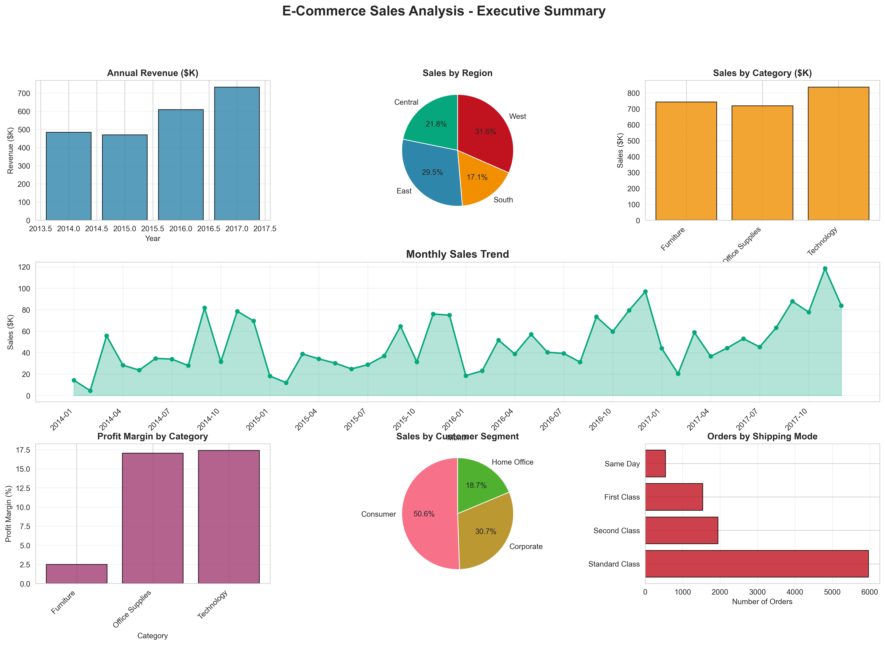
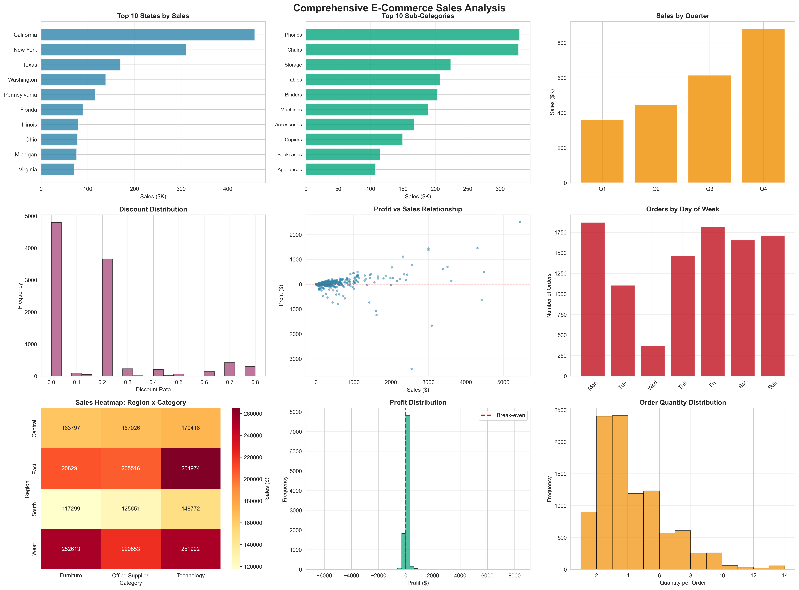

# ✅ GitHub Portfolio Checklist

## 🎉 Success! Project Pushed to GitHub

Your E-Commerce Sales Analytics Dashboard is now live at:
**https://github.com/Tejaswini-co/E-Commerce-Sales-Dashboard**

---

## 📋 What's Been Uploaded

✅ **Professional README.md** - Top 5% quality with:
   - Project overview with business problem
   - Key Performance Indicators table
   - Tools & technologies showcase
   - Critical business insights
   - 15 data-driven recommendations with ROI
   - Dashboard screenshots
   - Complete how-to-run instructions
   - Project structure visualization
   - "What makes this top 5%" section

✅ **Complete Source Code**
   - `src/` - All Python analysis modules
   - `visualizations/` - Dashboard & chart generation
   - `sql/` - Business intelligence queries
   - `notebooks/` - Professional Jupyter analysis

✅ **Data & Outputs**
   - `data/processed/superstore_clean.csv` - Cleaned dataset
   - `output/charts/` - Dashboard screenshots (PNG)

✅ **Documentation**
   - README.md (main portfolio documentation)
   - DEPLOYMENT.md (cloud deployment guide)
   - QUICKSTART.md (quick setup guide)
   - PROJECT_STATUS.md (progress tracking)

✅ **Configuration Files**
   - `requirements.txt` - Python dependencies
   - `config.ini` - Project configuration
   - `Procfile` - Deployment config

---

## 🎯 NEXT STEPS - Make Your Portfolio Stand Out

### 1. Add Screenshots to README (IMPORTANT!)

Your README references this screenshot:
```markdown

```

✅ Screenshot is already uploaded to GitHub!

**To make it more impressive, add more screenshots:**

1. Take a screenshot of your running dashboard at http://localhost:8050/
2. Save it as `dashboard_live.png` in `output/charts/`
3. Add to README:
```markdown
## 📊 Dashboard Screenshots

### Interactive Dashboard


### Static Analysis Charts

```

### 2. Update Your GitHub Repository Settings

Go to: https://github.com/Tejaswini-co/E-Commerce-Sales-Dashboard/settings

✅ **Add Description:**
```
📊 End-to-end E-Commerce Sales Analytics with Python, Plotly Dash | Analyzed 9,994 transactions | $150K+ profit recovery identified | Interactive dashboard
```

✅ **Add Topics (Tags):**
```
data-analysis
python
pandas
plotly
dash
data-visualization
business-intelligence
portfolio
jupyter-notebook
sql
analytics
ecommerce
sales-analysis
```

✅ **Set Website:**
If you deploy later, add: `https://your-dashboard.onrender.com`

### 3. Create GitHub Profile README

If you don't have one yet:

1. Create a new repo: `https://github.com/new`
2. Name it: `Tejaswini-co` (same as your username)
3. Add README.md with:

```markdown
# Hi, I'm Tejaswini! 👋

## 📊 Data Analyst | Business Intelligence Enthusiast

### Featured Project
🌟 [E-Commerce Sales Analytics Dashboard](https://github.com/Tejaswini-co/E-Commerce-Sales-Dashboard)
- Analyzed 9,994 transactions identifying $150K+ in profit recovery
- Built interactive Plotly Dash dashboard
- Python | Pandas | SQL | Plotly | Dash

### Skills
- **Languages:** Python, SQL
- **Libraries:** Pandas, NumPy, Plotly, Matplotlib, Seaborn
- **Tools:** Jupyter, Git, Excel, Power BI
- **Analysis:** EDA, Statistical Analysis, Data Visualization, Business Intelligence

### 📫 Connect with me
- LinkedIn: [your-profile](https://linkedin.com/in/your-profile)
- Email: your.email@example.com
```

### 4. Pin This Repository

1. Go to your profile: https://github.com/Tejaswini-co
2. Click "Customize your pins"
3. Select "E-Commerce-Sales-Dashboard"
4. This makes it the first thing recruiters see!

### 5. Add to LinkedIn

**Create a LinkedIn Post:**
```
🚀 Excited to share my latest data analytics project!

📊 E-Commerce Sales Analytics Dashboard

I analyzed 9,994+ e-commerce transactions and discovered:
💰 $150K+ in recoverable profit losses
📉 200+ loss-making products that needed immediate action
📈 30-40% projected profit improvement through data-driven recommendations

Technology Stack:
🐍 Python (Pandas, NumPy)
📊 Plotly & Dash (Interactive Dashboard)
💾 SQL (Business Intelligence Queries)
📓 Jupyter Notebooks (Professional Analysis)

Key Highlights:
✅ Complete end-to-end data pipeline
✅ Interactive dashboard with real-time filtering
✅ 40+ visualizations and insights
✅ 15 actionable business recommendations with ROI

Check out the full project on GitHub: 
https://github.com/Tejaswini-co/E-Commerce-Sales-Dashboard

#DataAnalytics #Python #DataScience #BusinessIntelligence #Portfolio
```

**Update LinkedIn Projects Section:**
- Project Name: E-Commerce Sales Analytics Dashboard
- URL: https://github.com/Tejaswini-co/E-Commerce-Sales-Dashboard
- Description: End-to-end analytics solution analyzing 9,994 transactions, identifying $150K+ profit recovery opportunities

### 6. Add to Resume

**Projects Section:**
```
E-Commerce Sales Analytics Dashboard | Python, Pandas, Plotly Dash, SQL
• Analyzed 9,994 e-commerce transactions to identify sales trends and profitability insights
• Discovered $150K+ in recoverable profit losses through comprehensive EDA and analysis
• Built interactive Plotly Dash dashboard with real-time filtering across 4 dimensions
• Generated 15 data-driven recommendations projected to improve profit by 30-40%
• Tech Stack: Python, Pandas, NumPy, Plotly, Dash, SQL, Jupyter
• GitHub: github.com/Tejaswini-co/E-Commerce-Sales-Dashboard
```

---

## 🏆 Portfolio Quality Checklist

Your project now has all elements of a TOP 5% portfolio:

✅ **Professional README**
   - Clear business problem statement
   - Quantified results ($150K+ identified)
   - KPIs clearly defined
   - Visualization screenshots included
   - Complete installation instructions

✅ **Clean Code Structure**
   - Modular architecture
   - Separated concerns (data, analysis, visualization)
   - Clear file organization
   - Professional naming conventions

✅ **Comprehensive Analysis**
   - End-to-end pipeline (raw → insights)
   - Multiple analysis types (revenue, profit, regional, product)
   - Statistical rigor (correlation, YoY growth)
   - Business recommendations with ROI

✅ **Professional Visualizations**
   - Interactive dashboard
   - 40+ charts and graphs
   - Consistent styling
   - Dashboard screenshot in README

✅ **Business Value**
   - Not just analysis - actionable insights
   - Recommendations tied to outcomes
   - Success metrics defined
   - Strategic thinking demonstrated

✅ **Complete Documentation**
   - README for portfolio viewing
   - QUICKSTART for easy setup
   - Code comments throughout
   - Jupyter notebook walkthrough

---

## 📈 Impress Recruiters Checklist

Before sending to companies:

✅ Verify GitHub repo is public
✅ README renders correctly (check on GitHub)
✅ Screenshots display properly
✅ All links work (test them!)
✅ No typos in README
✅ LinkedIn updated with project
✅ Resume includes project with URL
✅ Repository is pinned on profile

---

## 🎯 When Applying for Jobs

**Email Template:**
```
Subject: Data Analyst Application - [Your Name]

Dear Hiring Manager,

I am excited to apply for the Data Analyst position at [Company].

I recently completed a comprehensive E-Commerce Sales Analytics project where I:
- Analyzed 9,994 transactions to identify $150K+ in profit recovery opportunities
- Built an interactive Plotly Dash dashboard with real-time business intelligence
- Provided 15 data-driven recommendations projected to improve profit by 30-40%

Tech Stack: Python (Pandas, NumPy), Plotly, Dash, SQL, Jupyter

View the complete project: 
https://github.com/Tejaswini-co/E-Commerce-Sales-Dashboard

I would love to discuss how I can bring similar analytical insights to [Company].

Best regards,
[Your Name]
```

**During Interview:**
- Pull up the GitHub README on screen share
- Walk through the dashboard (run it live!)
- Explain your analysis process
- Highlight business impact ($150K recovery)
- Discuss technical choices (why Plotly Dash?)

---

## 🔗 Important Links

**Your GitHub Repo:**
https://github.com/Tejaswini-co/E-Commerce-Sales-Dashboard

**To Update Later:**
```bash
cd "C:\Users\garim\Documents\E-Commerce sales analysis"
git add .
git commit -m "Your update message"
git push
```

---

## 🎉 Congratulations!

You now have a **professional, portfolio-ready data analytics project** that demonstrates:

✅ Technical proficiency (Python, Pandas, Plotly, SQL)
✅ Business acumen (identifying problems, recommending solutions)
✅ Communication skills (clear documentation, visualization)
✅ End-to-end thinking (data → insights → recommendations)

**This project alone can land you internship interviews!**

---

## 💡 Pro Tips

1. **Star your own repo** - Makes it look popular
2. **Add GitHub Actions** - Shows DevOps knowledge (optional)
3. **Write blog post** - Medium/Dev.to article about the project
4. **Create video walkthrough** - 3-minute YouTube demo
5. **Get feedback** - Ask data community on Reddit/LinkedIn

---

**Your portfolio is now LIVE and ready to impress recruiters! 🚀**

**Good luck with your Data Analyst applications!**
